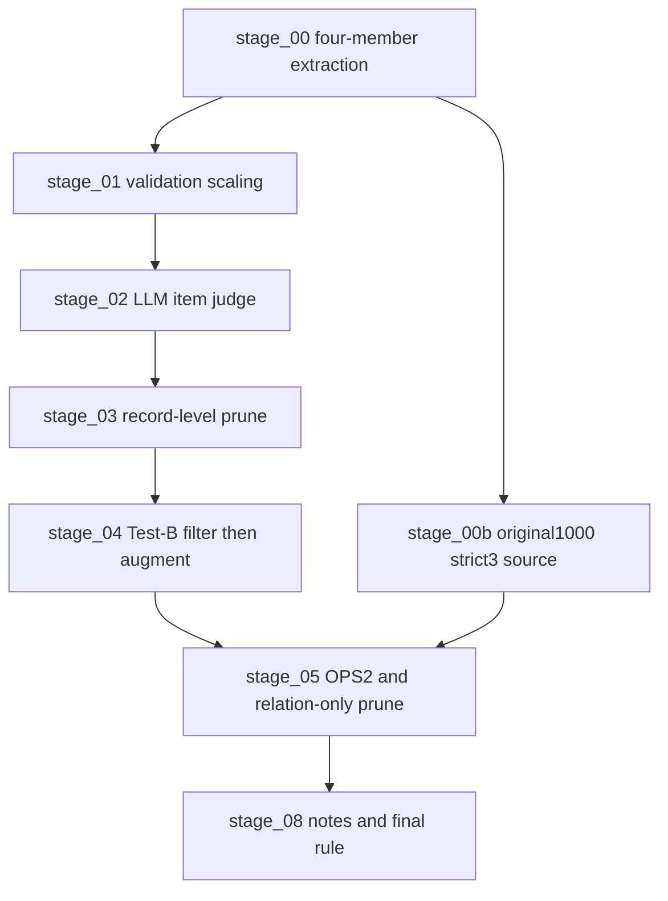

# Pipeline Stage Index

## stage_00_external_project_src

- Type: `online/API required`
- Purpose: Original CCL project support code: prompts, model client, member inference, ensemble voting, submission building, relation sanity filters.

## stage_00b_test_b_original1000_4member

- Type: `online/API required`
- Purpose: Test-B four-member run using only the official original 1000 labeled records, used to create the conservative strict3 relation source.

## stage_01_validation_scaling_code

- Type: `online/API required`
- Purpose: validation scaling, holdout experiments, augmented candidate generation and supporting model runs.

## stage_02_original1000_judge_code

- Type: `online/API required`
- Purpose: item-level LLM judge for entity/relation keep/drop/fix decisions.

## stage_03_record_level_filter_prune_code

- Type: `online/API required`
- Purpose: record-level highscore prune and entity-pair OPS apply strategy.

## stage_04_testb_filter_then_augment_code

- Type: `online/API required`
- Purpose: Test-B filter-then-union augmentation, span-only dedup logic, AI entity/relation audit application.

## stage_05_ops_relation_prune_code

- Type: `online/API required`
- Purpose: OPS2 full filtering and repeated relation-only OPS pruning.

## stage_06_10x100_proxy_validation_inputs_and_refs

- Type: `offline/reference`
- Purpose: proxy-validation runner and validation references used to choose submission strategy.

## stage_08_notes_and_handoff

- Type: `offline/reference`
- Purpose: experiment notes and handoff summaries.

## Pipeline Flow

## Final Winning Rule

Use high-NER entities from the round12 entity-keep run, keep `HAS=267`, drop all `USE`, then add only non-`HAS`/non-`USE` original1000 strict3 relations whose endpoints already exist.

